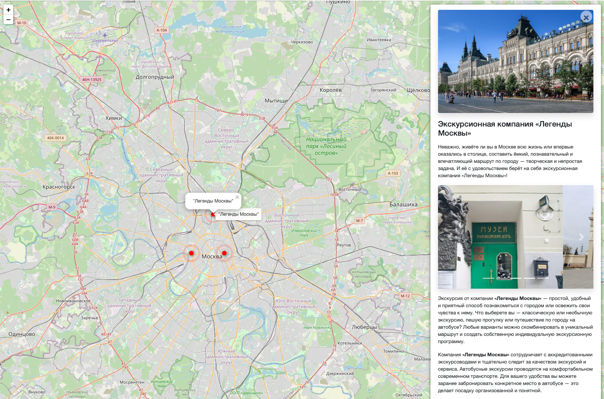
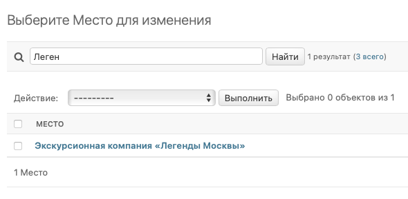
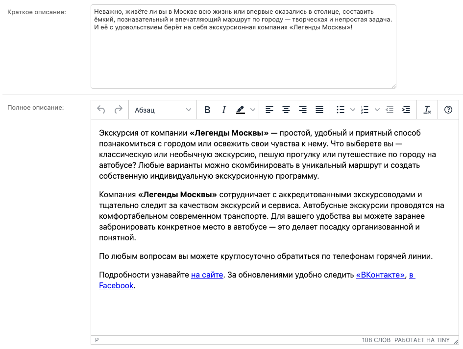
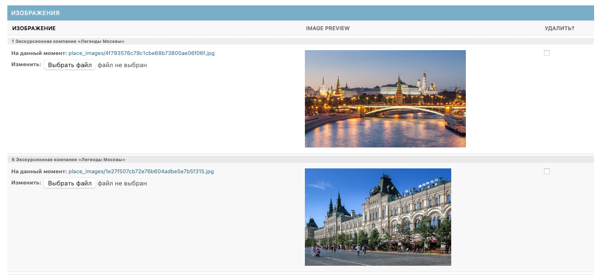
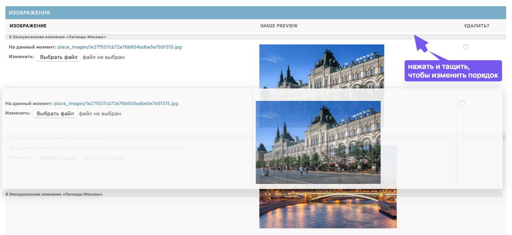
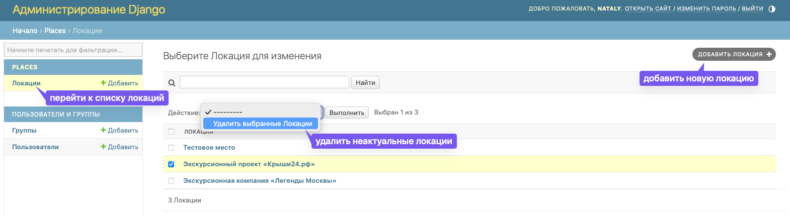

# Интерактивная карта Москвы

Этот проект представляет собой интерактивную карту Москвы, на которой пользователи могут просматривать различные виды
активного отдыха с подробными описаниями и комментариями. 


Возможные активности добавляются администратором вручную через удобный интерфейс.

## Установка при развертывании проекта локально

Для установки проекта, выполните следующие шаги:

1. Склонируйте репозиторий:
```bash
git clone https://github.com/ваш-пользователь/ваш-репозиторий.git
```
2. Создайте виртуальное окружение и активируйте его:
```bash
python -m venv env
source env/bin/activate
```
Работоспособность проекта протестирована на python 3.10 и python 3.11

3. Установите зависимости:
```bash
pip install -r requirements.txt
```
4. Примените миграции:
```bash
python manage.py migrate
```
5. Заполните базу данных тестовыми данными:
```
python manage.py load_place <http://адрес/файла.json>
```
Данные для локаций можно взять по [ссылке](https://github.com/devmanorg/where-to-go-places). 
Следуйте инструкции для получения адресов для последующего скачивания.
6. Создайте файл .env и заполните в нем следующие переменные:
```
SECRET_KEY=<YOUR SECRET KEY>
DEBUG=True
ALLOWED_HOSTS='127.0.0.1'
CSRF_COOKIE_SECURE=<True or False>
SESSION_COOKIE_SECURE=<True or False>
SECURE_SSL_REDIRECT=<True or False>
SECURE_HSTS_SECONDS=31536000
SECURE_HSTS_INCLUDE_SUBDOMAINS=<True or False>
SECURE_HSTS_PRELOAD=<True or False>
SESSION_COOKIE_SECURE=<True or False>
MEDIA_URL=<Directory where collected mediafile>
STATIC_URL=<Directory where collected static>
```
**SECRET_KEY** - Секретный ключ для конкретной установки Django. Он используется для обеспечения cryptographic signing,
и должен быть установлен на уникальное, непредсказуемое значение. Сгенерировать SECRET_KEY можно по
[ссылке](https://djecrety.ir/).

**DEBUG** - Булево значение, которое включает/выключает режим отладки. 
Подробнее по [ссылке](https://django.fun/ru/docs/django/4.2/ref/settings/#debug).

**ALLOWED_HOSTS** - Список представляющий хостов, который обслуживает джанго сайт.
Подробнее по [ссылка](https://django.fun/docs/django/5.0/ref/settings/#allowed-hosts)

**CSRF_COOKIE_SECURE** - Булево значение, если True , cookie будет помечен как «безопасный», что означает,
что браузеры могут гарантировать, что cookie будет отправлен только при HTTPS-соединении.

**SESSION_COOKIE_SECURE** - Если установлено значение True, cookie будет помечен как «безопасный», что означает,
что браузеры могут гарантировать, что cookie будет отправлен только по соединению HTTPS.

**SECURE_SSL_REDIRECT** - Если True, все не-HTTPS запросы переводятся на HTTPS.

**SECURE_HSTS_SECONDS** - Если установлено ненулевое целочисленное значение, SecurityMiddleware устанавливает заголовок
[Строгая транспортная безопасность](https://django.fun/docs/django/5.0/ref/middleware/#http-strict-transport-security).
Неверная настройка может (временно вывести сайт из строя)

**SECURE_HSTS_INCLUDE_SUBDOMAINS** - Если True, SecurityMiddleware добавляет директиву includeSubDomains к
заголовку Строгая транспортная безопасность HTTP.

**SESSION_COOKIE_SECURE** - Если установлено значение True, cookie будет помечен как «безопасный», что означает,
что браузеры могут гарантировать, что cookie будет отправлен только по соединению HTTPS.

**MEDIA_URL** -URL, который обрабатывает медиа, обслуживаемые из MEDIA_ROOT, используемый для managing stored files.

**STATIC_URL** - URL для использования при обращении к статическим файлам, расположенным в STATIC_ROOT.


## Использование

### Если Вы развернули проект локально

Запустите сервер разработки:
```bash
python manage.py runserver
```
Откройте браузер и перейдите по адресу http://localhost:8000/ для просмотра интерактивной карты Москвы.
Чтобы добавить или изменить локации, 
Вам необходимо перейти в интерфейс администратора по ссылке: http://localhost:8000/admin.

Перед использованием интерфейса администратора нужно создать суперпользователя. Для этого выполните команду:
```bash
python manage.py createsuperuser
```
Вас попросят ввести имя пользователя, адрес электронной почты и пароль для нового суперпользователя.
Запомните эти данные, так как они понадобятся для входа в админку.

### Если Вы хотите использовать опубликованную версию

Перейдите по [ссылке](https://sasagete.pythonanywhere.com/), чтобы посмотреть, как работает интерактивная карта.
Чтобы добавить или изменить локации, Вам необходимо перейти в интерфейс администратора по [ссылке](https://sasagete.pythonanywhere.com/admin).

**Чтобы использовать интерфейс администратора в опубликованной версии у Вас должен быть логин и пароль для входа.**

**Интерфейс администратора позволяет:**

1. Просмотреть список локаций и найти локацию по названию (поиск чувствителен к регистру).
    
2. Перейти на страницу редактирования локации и для каждой локации:
   - Обновить текстовки
   
   - Залить новые картинки и удалить старые
   
   - Выбрать самые яркие картинки и переместить их в начало списка, чтобы изменить порядок их отображения на сайте.
   
3. Добавить новые локации или удалить старые
   


## Цели проекта

Код написан в учебных целях — это урок в курсе по Python и веб-разработке на сайте [Devman](https://dvmn.org).

Тестовые данные взяты с сайта [KudaGo](https://kudago.com).
